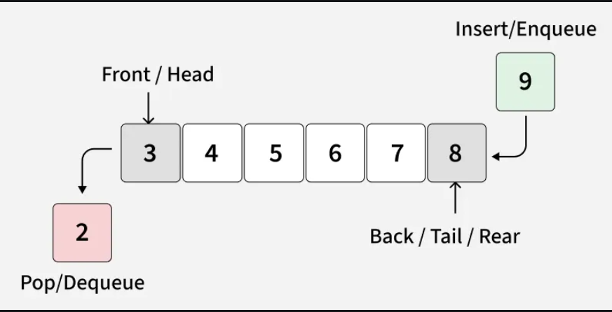
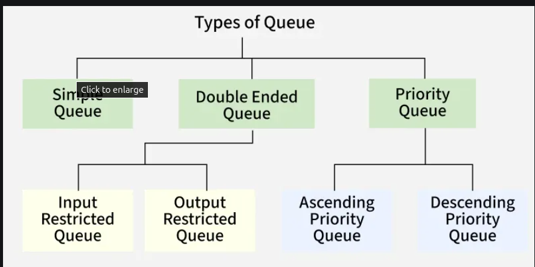
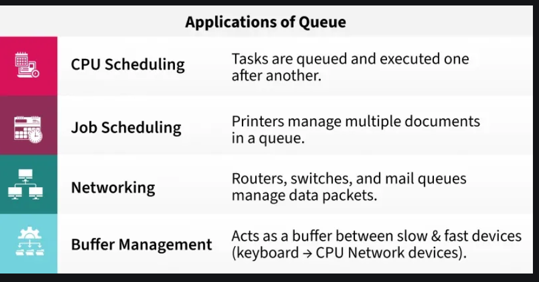

# QUEUE

### Defintion

#### A Queue Data Structure is a fundamental concept in computer science used for storing and managing data in a specific order.

* It follows the principle of "First in, First out" (FIFO), where the first element added to the queue is the first one to be removed.

* It is used as a buffer in computer systems where we have speed mismatch between two devices that communicate with each other. For example, CPU and keyboard and two devices in a network

* Queue is also used in Operating System algorithms like CPU Scheduling and Memory Management, and many standard algorithms like 
  Breadth First Search of Graph, Level Order Traversal of a Tree.

### FIFO Principle in Queue:

### Types of Queues

### Real World Use Cases

